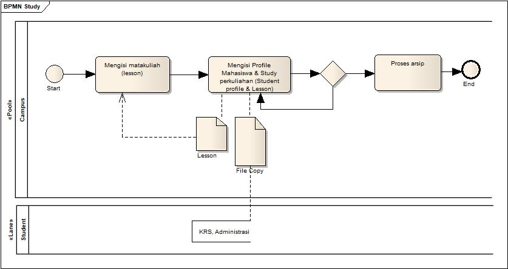
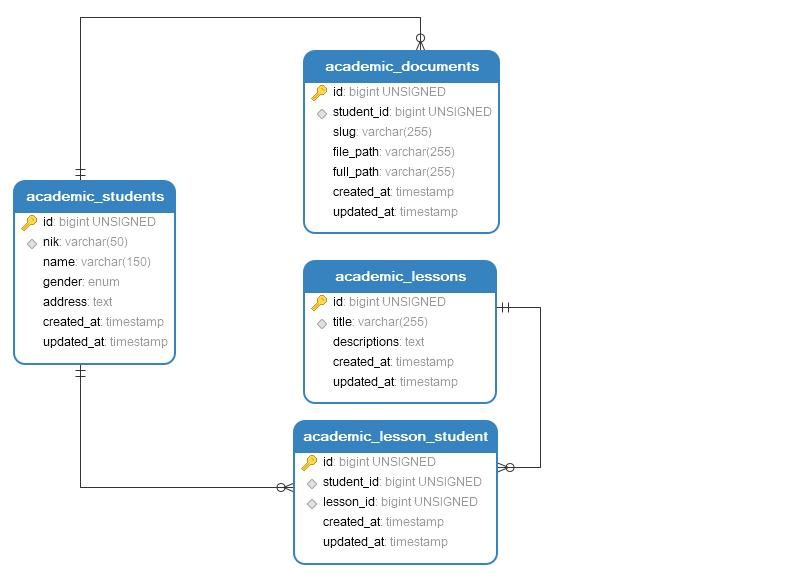
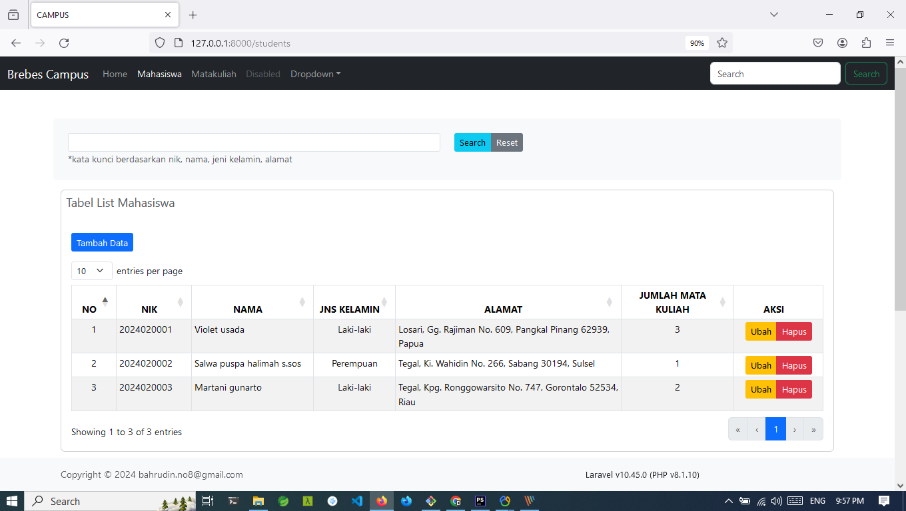
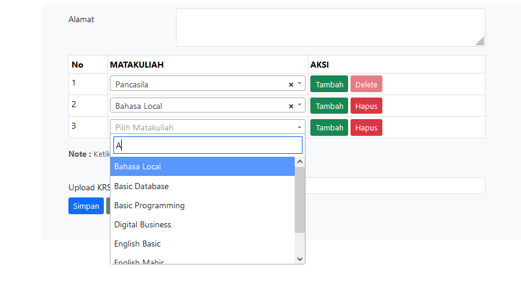
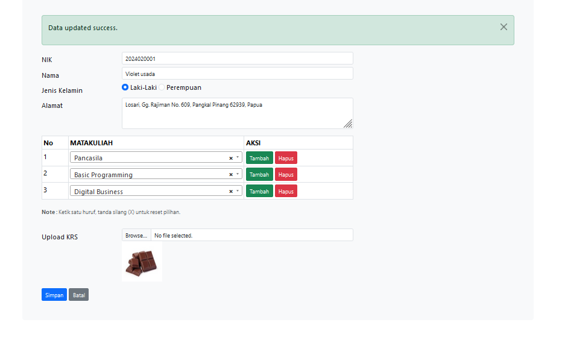
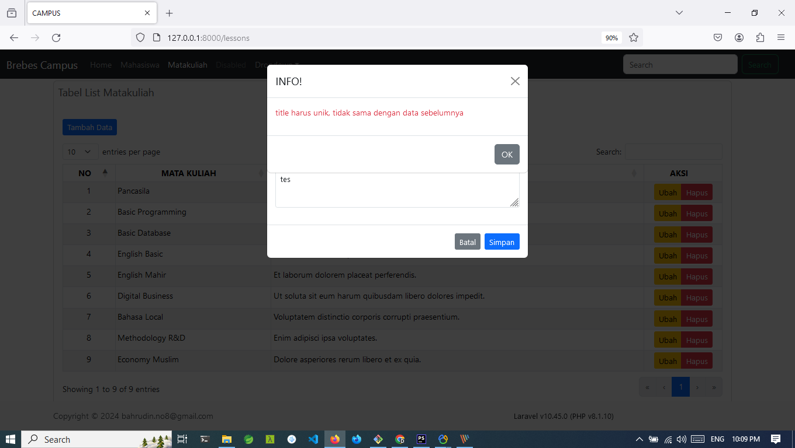

## Brebes Campus
Menggunakan Laravel framework web ini dibuat untuk assessment sederhana saja

## <a href="install/docs/Doc-Apps.pdf">Wiki<a/>
Full ViteJs, jQuery, Ajax, Datatables, Eloquent ORM, BelongToMany, HasMany, Bootstrap style 

## Panduan
Dependency
- Dependency framework : composer install
- Dependency module : npm install
- Dependency asset : npm run build

Config
- Copy file : cp .env.example .env
- generate key : php artisan key:generate
- Sesuaikan database di file .env
- Migrasi Tabel dan dummy data: php artisan migrate:fresh --seed
- Untuk upload path folder : php artisan storage:link 
- Jalankan aplikasi : php artisan serv 

Upload Files
- Untuk path folder : php artisan storage:link 

## Gallery

## Docs

PDF file: <a href="install/docs/Doc-Apps.pdf">Download</a> Display.

